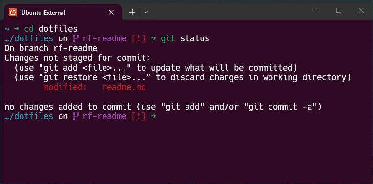

# 🛠️ Master Terminal Configuration

**By [Samuel Santana](https://linkedin.com/in/samuel-santana-iii)** | [GitHub](https://github.com/samuel-santana-iii)

My personal "Master Class" configuration for Linux. This repository automates the installation and configuration of a modern, Rust-based terminal environment across multiple distributions.

I got tired of rebuilding my development environment every time I distrohopped or setup a new machine. Now I checkout this repository and run my install scripts to save me hours of configuration, and keeps my workflow consistent across my machines.



## ⚡ The Stack

* **Shell:** `Zsh` (Autosuggestions, Syntax Highlighting, Custom Git Aliases)
* **Prompt:** `Starship` (Cross-shell, minimal, fast)
* **Navigation:** `Zoxide` (Smarter `cd`)
* **Editors:**
  * `Vim` (Minimal config for quick edits)
  * `Neovim + LazyVim` (Full IDE experience with LSP, Treesitter, Telescope)
* **Viewer:** `Bat` (Better `cat` with syntax highlighting)
* **Search:** `ripgrep` (Fast code search)
* **Finder:** `fd` (Fast file finder)

## Skills Demonstrated

- Shell scripting (Bash)
- Configuration management & automation
- Cross-platform Linux support
- Technical documentation

---

## 🛑 Prerequisites

### For WSL Users (Windows Side)

If running on WSL, you'll need a Nerd Font installed in Windows Terminal to render icons properly.

1.  **Download:** [JetBrainsMono Nerd Font](https://github.com/ryanoasis/nerd-fonts/releases/download/v3.0.2/JetBrainsMono.zip)
2.  **Install:** Extract -> Select all `.ttf` -> Right Click -> **Install**.
3.  **Configure:** Windows Terminal Settings -> Ubuntu Profile -> Appearance -> Font face -> **JetBrainsMono NF**.

### Supported Distributions

**install.sh** works on:
- **Debian/Ubuntu-based:** Ubuntu, Debian, Linux Mint, etc.
- **Arch-based:** Arch Linux, Manjaro, CachyOS, EndeavourOS, etc.
- **Fedora/RHEL-based:** Fedora, Nobara, AlmaLinux, Rocky Linux, etc.

**install-dev-tools.sh** is distro-agnostic and works on all Linux distributions.

---

## 🚀 Quick Install

On any supported Linux distribution, run these commands:

```bash
# Clone the repository
git clone https://github.com/samuel-santana-iii/dotfiles.git ~/dotfiles

# Run the core shell setup
chmod +x ~/dotfiles/install.sh
~/dotfiles/install.sh

# (Optional) Install development tools
chmod +x ~/dotfiles/install-dev-tools.sh
~/dotfiles/install-dev-tools.sh
```

**Restart your terminal** after the scripts finish.

**First Neovim Launch:** The first time you run `nvim`, it will download and install LazyVim plugins (1-2 minutes). After setup completes, run `:LazyHealth` to verify everything works.

---

## 📂 Repository Structure

The `install.sh` script creates symlinks from your home directory to this folder. This allows you to edit files here and have changes apply instantly.

```text
~/dotfiles/
├── install.sh              # Core shell setup (zsh, vim, neovim, starship, zoxide)
├── install-dev-tools.sh    # Development tools (Node, AI CLIs)
├── zshrc                   # Linked to ~/.zshrc
├── vimrc                   # Linked to ~/.vimrc
└── config/
    ├── starship.toml       # Linked to ~/.config/starship.toml
    └── nvim/               # Linked to ~/.config/nvim (LazyVim)
        ├── init.lua
        └── lua/
            ├── config/     # Editor settings and keymaps
            └── plugins/    # Custom plugin configs
```

---

## 🔧 Manual Mappings (Reference)

If the script fails or you prefer manual linking:

| System Location | Repo Location | Description |
| :--- | :--- | :--- |
| `~/.zshrc` | `./zshrc` | Main shell config |
| `~/.vimrc` | `./vimrc` | Minimal Vim config |
| `~/.config/nvim/` | `./config/nvim/` | Neovim/LazyVim config |
| `~/.config/starship.toml` | `./config/starship.toml` | Prompt theme |

## ⌨️ Cheatsheet

### Zoxide (Navigation)
* `z <name>`: Jump to directory (fuzzy match)
* `z -`: Go back to previous directory

### Vim (Editor)
* **Paste from Windows:** `Ctrl` + `Shift` + `v` (Make sure to be in Insert Mode `i`)

### Neovim (LazyVim)
* **Open file:** `nvim <filename>`
* **Show all keybindings:** `<space>` (which-key menu)
* **File explorer:** `<space>e` (Neo-tree)
* **Find files:** `<space><space>` (Telescope)
* **Search in files:** `<space>sg` (Telescope grep)
* **Toggle terminal:** `<Ctrl>` + `/` (floating terminal window)
* **Split window:** `<space>|` (vertical) or `<space>-` (horizontal)
* **Plugin manager:** `:Lazy`
* **Health check:** `:LazyHealth`
* **LSP info:** `:LspInfo`

For full LazyVim keybindings: https://www.lazyvim.org/keymaps
